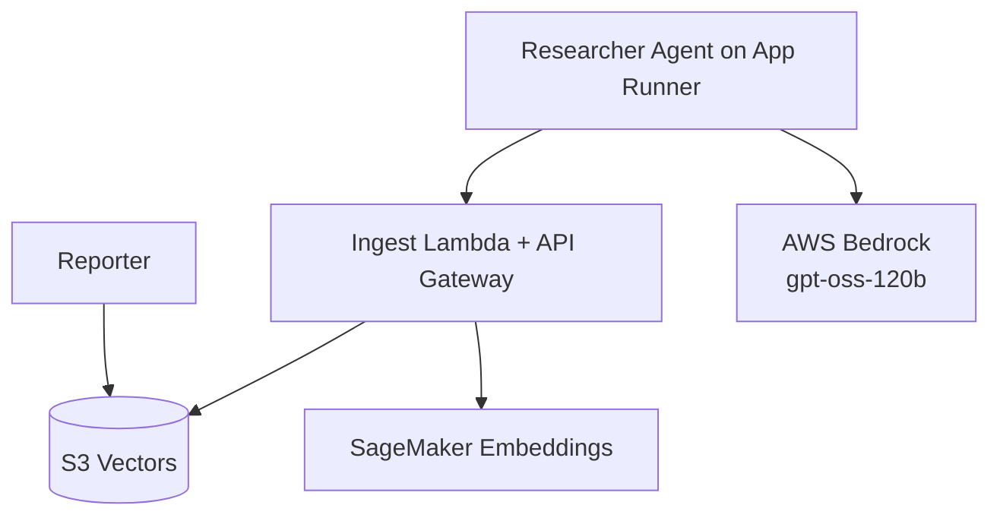

# Alex - Agentic Learning Equities Explainer

<p align="center">
  
</p>

<p align="center">
  <strong>Enterprise-grade, multi-agent financial planning SaaS built on AWS + OpenAI Agents SDK</strong><br/>
  Researches markets, ingests knowledge, analyzes portfolios, generates charts, and projects retirement outcomes.
</p>


<p align="center">
  
  
  
  
  
  
  
  
  
  
  
</p>

<br/>

## Table of Contents

1. [What Alex Does](#what-alex-does)
2. [Architecture](#architecture)
3. [Core Features](#core-features)
4. [Repository Structure](#repository-structure)
5. [Getting Started](#getting-started)
6. [Deployment Flow by Guide](#deployment-flow-by-guide)
7. [Researcher Runtime Tuning](#researcher-runtime-tuning)
8. [Testing Strategy](#testing-strategy)
9. [Cost and Operations](#cost-and-operations)
10. [Troubleshooting](#troubleshooting)
11. [Roadmap Ideas](#roadmap-ideas)
12. [Disclaimer](#disclaimer)

<br/>

## What Alex Does

Alex is a multi-agent SaaS financial advisor platform that:

- Researches current market topics using a browsing-capable agent
- Stores research as semantic vectors for retrieval
<br/>

## Architecture



<br/>

## Core Features

- Multi-agent orchestration with specialized responsibilities
- Autonomous market research + ingestion pipeline
- Cost-optimized vector search using S3 Vectors
- Production-ready deployment using Terraform per-guide modules
- Cloud-native observability via CloudWatch/App Runner logs

<br/>

## Repository Structure

```bash
alex/
├── guides/
│   ├── 1_permissions.md
│   ├── 2_sagemaker.md
│   ├── 3_ingest.md
│   ├── 4_researcher.md
├── backend/
│   ├── researcher/
│   ├── ingest/
│   └── api/
├── terraform/
│   ├── 2_sagemaker/
│   ├── 3_ingestion/
│   ├── 4_researcher/
└── scripts/
```

<br/>

## Getting Started

### Prerequisites

- AWS account + configured IAM user (`aws configure`)
- Terraform `>= 1.5`
- Docker Desktop running
- `uv` installed for Python project management

### Local setup

```bash
# from repo root
cp .env.example .env
```

Fill your `.env` with the required values as you progress through guides.

<br/>

## Deployment Flow by Guide

1. `guides/1_permissions.md` - IAM + foundational AWS access
2. `guides/2_sagemaker.md` - embeddings endpoint
3. `guides/3_ingest.md` - ingestion lambda + API + S3 vectors
4. `guides/4_researcher.md` - researcher on App Runner

<br/>

## Researcher Runtime Tuning

These env vars control reliability/latency behavior in `backend/researcher/server.py`:

```env
BEDROCK_MODEL_ID=openai.gpt-oss-120b-1:0
BEDROCK_REGION=us-west-2

RESEARCHER_MCP_TIMEOUT_SECONDS=30
RESEARCHER_MAX_TURNS=14
RESEARCHER_REQUEST_TIMEOUT_SECONDS=75
```

Tune recommendations:

- Lower values: faster responses, more fallback usage
- Higher values: deeper browsing, higher timeout risk

<br/>

## Testing Strategy

- Researcher health and live request:
```bash
cd backend/researcher
uv run test_research.py "MSFT cloud growth outlook"
```

- Ingest/search verification:
```bash
cd backend/ingest
uv run test_search_s3vectors.py
```

- Agent local smoke tests:
```bash
cd backend
uv run test_simple.py
```

<br/>

## Cost and Operations

Key operational notes:

- S3 Vectors is significantly cheaper than OpenSearch for this use case
- Destroy infra when inactive to avoid unnecessary spend

Example cleanup order:

```bash
cd terraform/4_researcher && terraform destroy
cd terraform/3_ingestion && terraform destroy
cd terraform/2_sagemaker && terraform destroy
```

<br/>

## Troubleshooting

- `504 upstream request timeout` on researcher:
  - Usually long browser loops or MCP timeout
  - Use bounded runtime env vars and fallback mode (already implemented)

- Bedrock model access errors:
  - Confirm model access in Bedrock region
  - Confirm `BEDROCK_REGION` and `BEDROCK_MODEL_ID`
  - LiteLLM requires `AWS_REGION_NAME` to be set

- Packaging failures:
  - Confirm Docker Desktop is running
  - Re-run packaging/deploy scripts with logs

<br/>

## Roadmap Ideas

- Add Polygon MCP integration for market-price enrichment
- Add structured “fact table” extraction pipeline to external DB (e.g., Supabase)
- Add SQS retry wrappers around researcher-triggered ingestion
- Add evaluator/critic agent for report quality scoring
- Add user-facing citation cards sourced from `record_source` ledger

<br/>

## Disclaimer

Alex is an educational project for learning production AI systems.  
It is **not financial advice**. Always perform independent due diligence.

<br/>

## Acknowledgements

- Course: **AI in Production** by **Ed Donner**
- Project: **Alex - Agentic Learning Equities eXplainer**

