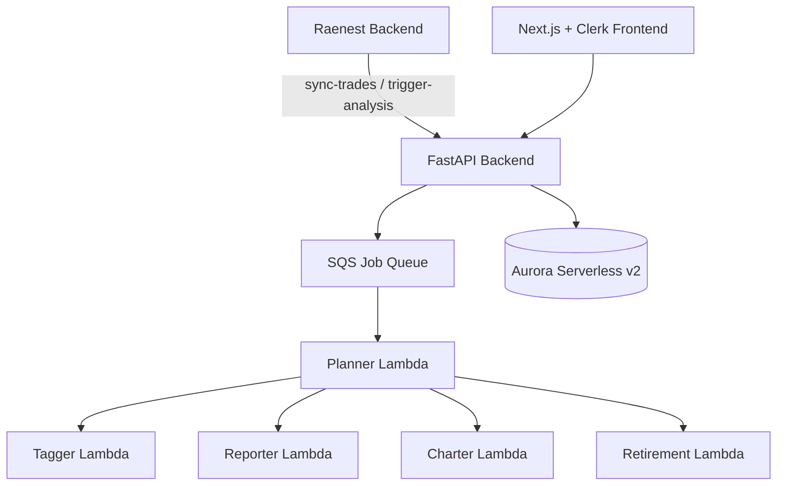

<div align="center">
  <h1>Alex - Agentic Learning Equities Explainer</h1>
  <p><strong>Raenest-ready, multi-agent US shares intelligence platform</strong></p>
</div>

<p align="center">
  Built for production workflows: trade sync, portfolio intelligence, AI analysis orchestration, and enterprise handover.
</p>

<p align="center">
  
  
  
  
  
  
  
  
  
  
  
  
</p>

---

## What This Project Solves

Alex is a production AI system for portfolio intelligence. It now includes a dedicated Raenest integration layer so US-share activity can be synced, analyzed, and surfaced as insights without breaking existing flows.

Core outcomes:

1. Trade events can be synced server-to-server into Alex accounts.
2. Portfolio intelligence (top holdings, concentration, sector exposure) is returned in API-ready format.
3. AI analysis jobs can be triggered from backend workflows and tracked through existing queue/orchestration.
4. The frontend is polished for enterprise ownership with operational status and handover views.

---

## Architecture



---

## Improvements Added

### 1) Deeper agentic researcher and resilience

1. Structured context engineering with explicit research objective/guardrails.
2. Run-scoped to-do tools for plan-execute-verify behavior.
3. Source ledger tools for citation discipline.
4. Ingestion guard to avoid duplicate writes.
5. Runtime controls to reduce App Runner 504 risk:
 - `RESEARCHER_MCP_TIMEOUT_SECONDS`
 - `RESEARCHER_MAX_TURNS`
 - `RESEARCHER_REQUEST_TIMEOUT_SECONDS`
6. Fallback execution path when browsing/tool loops fail.
7. Model and region moved to environment-driven configuration.

### 2) Raenest server-to-server integration layer

New secured endpoints in `backend/api/main.py`:

1. `POST /api/raenest/sync-trades`
2. `GET /api/raenest/portfolio-intelligence/{clerk_user_id}`
3. `POST /api/raenest/trigger-analysis`

Key behavior:

1. Auto-bootstrap user/account if missing.
2. Buy/sell trade application with position upsert and close-out handling.
3. Cash and estimated value summaries in USD with optional NGN conversion.
4. Risk flags (for example concentration >25%).
5. API key guard via `x-raenest-api-key`.

### 3) Enterprise API readiness and observability

1. Request ID middleware (`x-request-id`) for traceability.
2. Structured request logs (path, method, status, duration).
3. Request ID returned in error responses.
4. Readiness endpoint: `GET /api/ops/readiness`.

### 4) Professional UI and handover readiness

1. Repositioned product branding to "Alex for Raenest".
2. Added reusable enterprise components:
 - `frontend/components/EnterpriseStatusStrip.tsx`
 - `frontend/components/HandoverReadinessCard.tsx`
3. Updated `dashboard`, `advisor-team`, and `analysis` pages with status chips, trust language, and operational framing.
4. Added handover center page: `frontend/pages/handover.tsx`.
5. Introduced reusable style primitives in `frontend/styles/globals.css`:
 - `.surface-card`, `.surface-card-muted`
 - `.status-chip` variants
 - `.enterprise-hero`

---

## Handover Documentation

1. `RAENEST_INTEGRATION.md` - integration contracts and flow.
2. `ENTERPRISE_HANDOVER.md` - ownership model, SLO starter pack, security baseline.
3. `UI_HANDOVER.md` - design/UI standards and QA checklist.

---

## API Snapshot

### Health and readiness

1. `GET /health`
2. `GET /api/ops/readiness`

### Raenest integration

1. `POST /api/raenest/sync-trades`
2. `GET /api/raenest/portfolio-intelligence/{clerk_user_id}`
3. `POST /api/raenest/trigger-analysis`

All `/api/raenest/*` endpoints require:

```http
x-raenest-api-key: <RAENEST_API_KEY>
```

---

## Configuration

Important environment variables:

```env
# Bedrock and model
BEDROCK_MODEL_ID=openai.gpt-oss-120b-1:0
BEDROCK_REGION=us-west-2

# Researcher resilience controls
RESEARCHER_MCP_TIMEOUT_SECONDS=30
RESEARCHER_MAX_TURNS=14
RESEARCHER_REQUEST_TIMEOUT_SECONDS=75

# Integration security
RAENEST_API_KEY=replace_with_strong_server_side_key
```

---

## Deployment and Guide Flow

Follow the guides in order:

1. `guides/1_permissions.md`
2. `guides/2_sagemaker.md`
3. `guides/3_ingest.md`
4. `guides/4_researcher.md`
5. `guides/5_database.md`
6. `guides/6_agents.md`
7. `guides/7_frontend.md`
8. `guides/8_enterprise.md`

Each Terraform directory is independent and requires its own `terraform.tfvars`.

---

## Local Validation (Current)

Latest checks run successfully:

1. `frontend`: `npm run lint`
2. `frontend`: `npm run build`
3. `backend/api`: `uv run uvicorn main:app --help`

---

## Security and Compliance Baseline

1. Keep `RAENEST_API_KEY` server-side only.
2. Rotate keys/secrets regularly.
3. Apply least-privilege IAM policies.
4. Add WAF/IP allowlist for server-to-server endpoints where possible.
5. Preserve request IDs in incident workflows for auditability.

---

## Disclaimer

This project is educational and operationally oriented.  
It does not provide financial advice. Always involve qualified compliance and investment professionals before production use.
